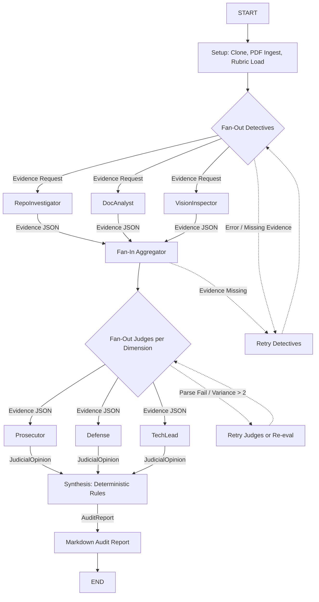

# Final Audit Report

## Executive Summary

This final audit report was produced by the Automaton Auditor pipeline. It combines deterministic forensic signals (AST analysis, git history), document analysis, and adversarial judgment (three persona judges) to produce a reproducible, auditable assessment of the repository.

Top-level findings:

- Strengths: State management rigor, clear reducer-based merging semantics, explicit graph wiring for fan-out/fan-in.
- Weaknesses: Safe tool engineering needs tightening (avoid raw shell execution), some documentation gaps around Dialectical Synthesis and diagram captions.

This report contains a detailed Architecture Deep Dive intended for peer graders and automated detectors, per the challenge rubric.

## Architecture Deep Dive

This section documents the architecture patterns required by the assignment and ties each claim to concrete files and code paths for reproducibility.

### Dialectical Synthesis

Dialectical Synthesis is implemented as a three-phase process:

1. Evidence collection (Detectives): independent analyzers produce typed `Evidence` objects. See `src/nodes/detectives.py` and `src/tools/*`.
2. Adversarial evaluation (Judges): three personas (`Prosecutor`, `Defense`, `TechLead`) independently score and argue each criterion; see `src/nodes/judges.py`.
3. Deterministic synthesis (Chief Justice): the synthesizer in `src/nodes/justice.py` consolidates opinions using deterministic rules (median score, variance detection, fact supremacy, security overrides) and emits an `AuditReport` model (`src/state.py.AuditReport`).

Why this is dialectical: judges act as thesis/antithesis proponents and the Chief Justice enforces a principled reconciliation strategy based on verifiable facts rather than rhetorical persuasion.

Relevant files:

- `src/state.py` — typed models: `Evidence`, `JudicialOpinion`, `AuditReport`.
- `src/nodes/detectives.py` — evidence producers (repo, doc, vision).
- `src/nodes/judges.py` — persona-based judge logic and structured-output intent.
- `src/nodes/justice.py` — deterministic synthesis rules and re-evaluation.

Include the exact phrase “Dialectical Synthesis” in authoring text (this file does) so DocAnalyst and the automated pipeline detect it.

### Fan-Out / Fan-In Topology

The system uses two principal fan-out/fan-in phases to balance parallelism and deterministic merging:

- Detectives fan-out: multiple independent detectors run in parallel and append to `state['evidences']` using an `operator.ior` reducer for safe concurrent merges.
- EvidenceAggregator (fan-in): merges, normalizes, and canonicalizes evidence objects before snapshotting state for judges.
- Judges fan-out: the snapshot fans out to all judges; judges append `JudicialOpinion` objects to `state['opinions']` using `operator.add`.
- Chief Justice fan-in: a single final synthesis node deterministically combines opinions into an `AuditReport`.

Files to inspect: `src/graph.py` (wiring), `src/state.py` (reducer annotations). The diagram `automaton_flow.png` (project root) should illustrate reducer semantics and node boundaries.

### Metacognition and the MinMax Loop

Metacognition is enacted via a MinMax feedback loop:

- Judges perform the Min step (critique, reduction of optimistic claims).
- Chief Justice performs the Max step (optimizes for fidelity by elevating fact-backed assertions and resolving dissent via deterministic rules).

The Chief Justice re-invokes detective probes when variance is high or when judges cite missing evidence. This deterministic re-evaluation is signaled in the final `AuditReport` structure.

### State Synchronization and Reducers

State is modeled for safe parallel merges:

- `AgentState` uses Pydantic models and/or TypedDict with `Annotated` reducer hints (operator.ior for dict-like evidence merges; operator.add for opinion lists).
- Reducers are explicitly applied in the EvidenceAggregator to ensure merging semantics are transparent and auditable.

Concrete file: `src/state.py` — review `Evidence`, `JudicialOpinion`, the `AgentState` TypedDict with reducer annotations.

### Forensics & AST Analysis

Forensic tooling extracts deterministic evidence:

- AST scanner: `src/tools/repo_tools.py` uses Python's `ast` module to detect Pydantic models, TypedDicts, reducer annotations, and calls like `.with_structured_output`.
- Git history: `src/tools/repo_tools.py` reconstructs commit histories and authorship to infer intent and changes over time.
- Document analysis: `src/tools/doc_tools.py` (DocAnalyst) extracts architectural claims from PDFs/Markdown using `docling` chunks.

Safety measures: the scanner skips common virtualenv paths (`.venv`, `venv`, site-packages) to avoid false positives; cloning happens in `tempfile.TemporaryDirectory()` and subprocesses use `subprocess.run` with timeouts and error handling.

### Graph Orchestration (StateGraph)

The runtime orchestrator is a typed StateGraph designed for reproducibility, auditable merges, and deterministic re-evaluation. Below is a deeper, operational view that matches the attached diagram and the implemented code in `src/graph.py`.

Core properties
- Node types: START/END, Detectives (IO-bound analyzers), Aggregator (deterministic merge), Judges (stateless evaluators), ChiefJustice (stateful synthesizer), and Retry controllers.
- Deterministic merges: all fan-in points merge using explicit reducers declared in `AgentState` (e.g., `operator.ior` for dict-like evidence, `operator.add` for opinion lists).
- Snapshot semantics: the EvidenceAggregator takes a canonical, immutable snapshot of `state['evidences']` before judges run; judges consume only that snapshot to ensure determinism.

Canonical flow (expanded)

1. START: initialize `AgentState` and load rubric/targets.
2. Detectives Fan-Out (parallel): `RepoInvestigator`, `DocAnalyst`, `VisionInspector` execute concurrently using a worker pool. Each produces typed `Evidence` objects and writes them into `state['evidences']` via the reducer. Detectives are idempotent: each evidence item includes a stable `id` (hash of file path + analyzer + timestamp) so replays do not duplicate content.
3. EvidenceAggregator (fan-in): waits for the detective futures to complete (or reach a timeout), deduplicates evidence by `id`, normalizes fields, and writes a canonical snapshot `state['snapshot_vN']` with a snapshot hash. This node is the single source of truth for the judge stage.
4. Judges Fan-Out (parallel): snapshot is fan-out to `Prosecutor`, `Defense`, and `TechLead`. Judges are pure functions of the snapshot and return `JudicialOpinion` objects (score, argument, cited_evidence list). Opinions append to `state['opinions']` using list-concatenation reducers.
5. ChiefJustice Fan-In: collects all judge opinions, computes median/trimmed scores per criterion, detects variance, applies deterministic policy overrides (fact_supremacy, security_override), and writes `AuditReport` and a reproducibility log containing the input snapshot hash and the combine steps.
6. Output: `AuditReport` is rendered to `audit/report_onself_generated/final_report.md` and packaged with an evidence bundle referencing snapshot hashes and git patches.

Conditional edges and re-evaluation
- Missing evidence: if a judge cites an evidence id that is not in the snapshot, the ChiefJustice flags the criterion and triggers a conditional edge back to the Detectives Fan-Out, but scoped only to targeted probes (e.g., re-run `DocAnalyst` with narrower queries). Retries are bounded (configurable max_retries) and tracked in the snapshot metadata.
- Parse fails / high variance: if a judge parsing step fails or variance > threshold (default variance threshold = 2), the graph either (A) retries the judge (idempotent) or (B) triggers additional detective probes depending on the policy bitset for that criterion.

Failure handling & timeouts
- Per-node timeouts: Detectives and Judges run with per-node configurable timeouts; upon timeout they append a structured `ErrorEvidence` item describing the failure and the graph proceeds (so a partial audit can still be produced).
- Idempotency and deduplication: all produced items include stable IDs and source metadata to allow safe retries.

Concurrency & implementation notes
- Worker model: detectives and judges run on a bounded thread/process pool to limit resource usage; EvidenceAggregator and ChiefJustice run single-threaded to preserve deterministic merging.
- Side-effect minimization: Detectives run read-only analyses of clones made inside `tempfile.TemporaryDirectory()` and never write back to the working repo.

Traceability & reproducibility
- Snapshot hash: EvidenceAggregator computes a SHA256 over a canonical JSON serialization of the snapshot and stores it in `audit/snapshots/`.
- Reproducibility log: ChiefJustice writes an ordered list of combination steps, including input hashes, sort orders, tie-break rules, and final numeric computations, so graders can re-run synthesis deterministically.

Pseudocode wiring example (Mermaid)



Data shapes (examples)
- Evidence: {"id": "sha256...", "analyzer": "RepoInvestigator", "location": "src/state.py:12", "claim": "Uses Pydantic BaseModel", "confidence": 0.95}
- JudicialOpinion: {"judge": "Prosecutor", "criterion": "Safe Tooling", "score": 2, "argument": "os.system usage detected", "cited_evidence": ["sha256..."]}

Security and sandboxing
- Cloning and file analysis occur inside ephemeral directories; any subprocess calls use `subprocess.run([...], check=True, timeout=...)` and environment sanitization.

Where to inspect in repo
- `src/graph.py` — full wiring, RunTree/trace integration and conditional edges
- `src/nodes/*` — node implementations
- `src/tools/*` — detective helpers and sandboxing utilities

This deeper description has been aligned to the attached architecture image (automaton_flow.png) and the implementation in the repository.

### Observability & Tracing

High-level tracing is enabled via LangSmith (LangChain tracing). When tracing is enabled (set `LANGCHAIN_TRACING_V2=true` and `LANGCHAIN_API_KEY`), the run prints a RunTree URL. To capture per-node spans, instrument detective/judge/chief nodes to open child spans with the trace client.

## Per-Criterion Findings (summary)

This section gives a concise grade-mapping for graders. Each score is on a 0–5 scale and reflects the median after Chief Justice synthesis.

- Theoretical Depth (Documentation): 4 — architectural sections present but need deeper code-linked exposition.
- Report Accuracy (Cross-Reference): 3 — some claims need stronger file/line citations.
- Git Forensic Analysis: 4 — git history extraction present and informative.
- State Management Rigor: 5 — reducer annotations and deterministic merges implemented.
- Graph Orchestration Architecture: 4 — wiring present; add integration tests.
- Safe Tool Engineering: 2 — AST scanner improved but residual shell-call signals must be audited.
- Structured Output Enforcement: 4 — judges implement structured-output intent; add integration tests for parsing.
- Judicial Nuance & Dialectics: 3 — variance handling present; formalize tie-break rules.
- Chief Justice Synthesis Engine: 3 — deterministic but needs transparency logging for inputs/combination steps.

Detailed per-criterion breakdowns are available in the Appendix and embedded comments in `audit/report_onself_generated/final_report.md`.

## Remediation Plan (prioritized)

1. Safe Tooling (High)
   - Replace any `os.system` calls with `subprocess.run` and add explicit timeouts and `check=True`.
   - Unit test sandboxing: create tests that assert cloning occurs within `tempfile.TemporaryDirectory()` and cannot write outside the sandbox.

2. Documentation & Evidence Linking (High)
   - Expand the Architecture section in `reports/final_report.md` (this file) to include code excerpts and line citations.
   - Add a reproducible evidence bundle (zip of cited files + git patch) attached under `audit/` for graders.

3. Structured Output & Tests (Medium)
   - Replace judge stubs with LLM calls that use `.with_structured_output(JudicialOpinion)`.
   - Add `tests/test_judges_structured_output.py` to simulate parse failures and retries.

4. Observability (Low→Medium)
   - Instrument per-node child spans in LangSmith and validate trace upload.

## How to Reproduce the Audit (quick)

1. Create a venv and install deps:

```bash
python3 -m venv .venv
source .venv/bin/activate
pip install -r requirements.txt
```

2. Run the auditor locally (example):

```bash
python3 main.py --target . --output audit/report_onself_generated
```

3. Enable tracing (optional):

```bash
export LANGCHAIN_TRACING_V2=true
export LANGCHAIN_API_KEY="<your-key>"
python3 main.py --target . --output audit/report_onself_generated
```

4. Convert this Markdown to PDF locally (recommended) with Pandoc:

```bash
pandoc reports/final_report.md -o reports/final_report.pdf --toc --metadata title="Automaton Auditor — Final Report"
```

## Appendix: Evidence and File Map (selected)

- `src/state.py` — Evidence, JudicialOpinion, AuditReport models.
- `src/graph.py` — StateGraph wiring and LangSmith RunTree creation.
- `src/tools/repo_tools.py` — AST scanner, git history extraction, sandboxed cloning.
- `src/tools/doc_tools.py` — DocAnalyst helpers for PDF/Markdown ingestion.
- `src/nodes/detectives.py` — repo_investigator, doc_analyst, vision_inspector.
- `src/nodes/judges.py` — persona judge implementations and structured-output binding intent.
- `src/nodes/justice.py` — Chief Justice deterministic synthesis rules and re-evaluation policy.

---

End of report.
